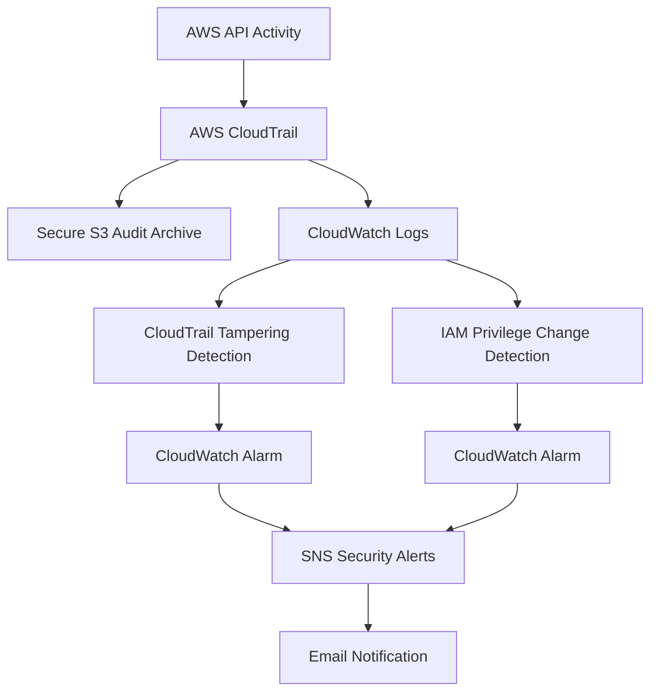

# AWS Threat Detection & Audit Baseline with Terraform

A Terraform-based AWS security project that builds centralized audit logging, threat detection, and automated alerting for security-relevant activity.

## Problem Statement

AWS environments generate large volumes of API activity, but simply collecting logs is not enough. Security teams need visibility into high-risk actions such as attempts to modify audit logging or make sensitive IAM permission changes.

This project builds an infrastructure-as-code security baseline that:

- Centralizes AWS API activity using CloudTrail
- Stores audit logs in a hardened S3 bucket
- Streams operational telemetry into CloudWatch Logs
- Detects CloudTrail tampering activity
- Detects sensitive IAM privilege changes
- Generates CloudWatch alarms from security events
- Sends automated security alerts through SNS
- Validates detections using controlled AWS API events


## Architecture




## Security Controls

### Secure S3 Audit Archive

The CloudTrail log bucket is configured with:

- Public access blocked
- Versioning enabled
- Server-side encryption using SSE-S3
- HTTPS-only access enforced through bucket policy
- Least-privilege permissions for CloudTrail log delivery

### CloudTrail Audit Logging

CloudTrail is configured to:

- Capture activity across multiple AWS Regions
- Include global service events
- Validate log file integrity
- Deliver logs to both S3 and CloudWatch Logs

### Least-Privilege IAM

A dedicated IAM role allows CloudTrail to send events to CloudWatch Logs with only the permissions required to:

- Create log streams
- Publish log events

## Detection Scenarios

### 1. CloudTrail Tampering

Detects security-relevant CloudTrail API activity including:

- `StopLogging`
- `DeleteTrail`
- `UpdateTrail`
- `PutEventSelectors`

A single matching event triggers a custom CloudWatch metric and security alarm.

### 2. IAM Privilege Changes

Detects sensitive IAM configuration changes including:

- `AttachRolePolicy`
- `PutRolePolicy`
- `UpdateAssumeRolePolicy`
- `CreatePolicyVersion`
- `SetDefaultPolicyVersion`

These actions can indicate legitimate administration, but they are also important signals when investigating privilege escalation or unauthorized permission changes.

## Validation & Test Results

The detection pipeline was validated using controlled AWS API activity rather than synthetic metrics.

### CloudTrail Tampering Test

A controlled `UpdateTrail` API call was executed against the existing trail while preserving the secure configuration.

Result:

- CloudTrail recorded the event
- CloudWatch Logs ingested the event
- The `CloudTrailTamperingDetected` metric filter matched it
- `CloudTrailTamperingCount` reached the alarm threshold
- The CloudWatch alarm transitioned from `OK` to `ALARM`
- SNS delivered an email security notification

### IAM Privilege Change Test

A disposable IAM role was created specifically for security testing. The AWS-managed `CloudWatchReadOnlyAccess` policy was temporarily attached to generate a real `AttachRolePolicy` event.

Result:

- CloudTrail recorded the IAM change
- The `IAMPrivilegeChangeDetected` filter matched the event
- `IAMPrivilegeChangeCount` reached the alarm threshold
- The IAM security alarm transitioned from `OK` to `ALARM`
- SNS successfully delivered an email notification
- The test policy was detached afterward
- A final `terraform plan` confirmed no configuration drift

## Detection Validation Workflow

```text
Deploy
  ↓
Generate controlled security event
  ↓
Observe CloudTrail telemetry
  ↓
Match detection rule
  ↓
Trigger CloudWatch alarm
  ↓
Receive SNS email alert
  ↓
Clean up test change
  ↓
Verify no Terraform drift

## Project Structure

```text
aws-secure-baseline-terraform/
├── providers.tf      # Terraform and AWS provider configuration
├── s3.tf             # Secure S3 audit log bucket and bucket policies
├── cloudtrail.tf     # Multi-Region CloudTrail configuration
├── cloudwatch.tf     # CloudWatch log group for security telemetry
├── iam.tf            # Least-privilege IAM role and permissions
├── detections.tf     # Security metric filters and CloudWatch alarms
├── alerts.tf         # SNS security alerting configuration
├── variables.tf      # Input variables for sensitive/runtime values
├── test-role.tf      # Disposable IAM role used for detection testing
├── .gitignore        # Excludes Terraform state and generated files
└── README.md